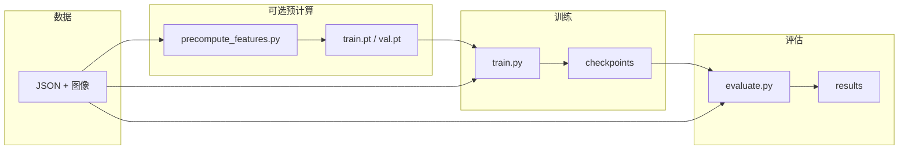
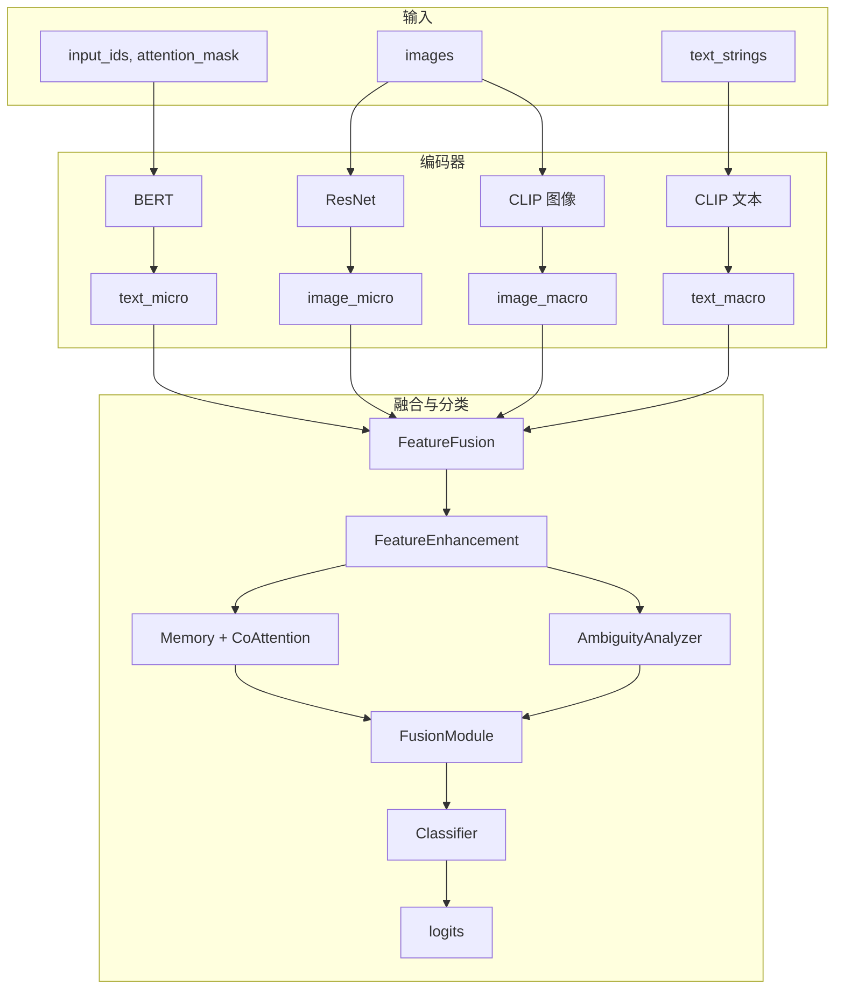
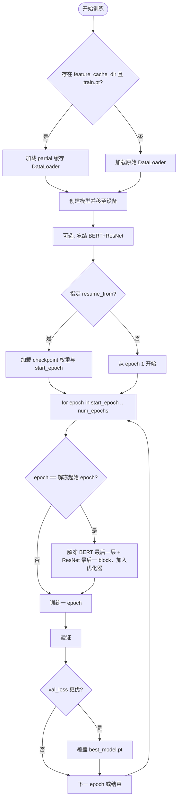
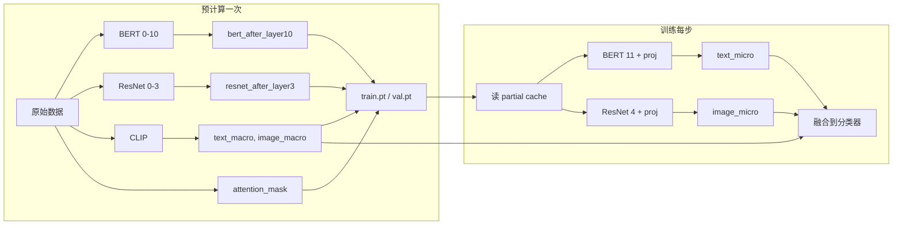

# CMFFA：跨模态特征融合与对齐的虚假信息检测模型

本项目实现论文《跨模态特征融合与对齐的虚假信息检测模型》中的 CMFFA 模型，用于图文多模态虚假信息二分类（Real / Fake）。

---

## 一、项目概览与逻辑关系

### 1.1 整体流程



- **数据**：每样本为 `text` + `image_path` + `label`（0=Real, 1=Fake），按 7:1:2 划分 train/val/test。
- **预计算**（可选）：运行 `scripts/precompute_features.py` 生成 **partial 缓存**（BERT 0–10、ResNet 0–3、CLIP 输出），存为 `train.pt` / `val.pt`。
- **训练**：`train.py` 可读原始数据或上述缓存；默认使用缓存时每步只跑 BERT 第 11 层 + ResNet 第 4 块 + 融合→分类器，最后 2 个 epoch 可轻量解冻上述层；支持从 checkpoint 继续训练。
- **评估**：`evaluate.py` 读原始数据 + 指定 checkpoint，输出指标与预测；支持 Fake 类决策阈值 `--threshold`。

### 1.2 模型前向逻辑（CMFFA）



- **编码器**：BERT 得微观文本特征 `text_micro`，ResNet 得微观图像特征 `image_micro`，CLIP 得宏观文本/图像特征 `text_macro` / `image_macro`。
- **融合与分类**：先做初级融合（FeatureFusion）与特征增强（FeatureEnhancement），再经可学习 Memory、Co-Attention 与歧义分析（AmbiguityAnalyzer），由 FusionModule 加权拼接后送入分类器得到二分类 logits。

### 1.3 训练流程（含 partial 缓存与轻量解冻）



- 若配置了 `feature_cache_dir` 且存在 `train.pt`，则使用 **partial 缓存**：每步只前向 BERT 第 11 层、ResNet 第 4 块与后续融合→分类器；否则使用原始输入走完整编码器。
- 若配置了 `resume_from` 或传入 `--resume`，则加载对应 checkpoint 的模型权重，从下一 epoch 继续（不加载 optimizer 状态）。
- 若开启 `unfreeze_last_layers`，在最后若干 epoch 解冻 BERT 最后一层与 ResNet 最后一 block，并用较小学习率加入优化器。

### 1.4 Partial 缓存数据流



- 预计算脚本只跑 BERT 前 10 层、ResNet 前 3 块和 CLIP，将 `bert_after_layer10`、`resnet_after_layer3`、`text_macro`、`image_macro`、`attention_mask`、`label` 写入 `train.pt` / `val.pt`。
- 训练时从缓存读入上述量，每步只跑 BERT 第 11 层 + proj、ResNet 第 4 块 + proj，得到 `text_micro` / `image_micro`，再与 CLIP 宏观特征一起进入融合与分类器。

### 1.5 评估流程

```mermaid
flowchart LR
  Config[config.yaml] --> LoadModel[创建模型]
  Args[--checkpoint, --config, --threshold] --> Resolve[解析 checkpoint 路径]
  Resolve --> LoadCkpt[加载 checkpoint 权重]
  LoadModel --> LoadCkpt
  LoadCkpt --> TestData[加载测试集原始数据]
  TestData --> Forward[完整模型前向]
  Forward --> Pred{指定 --threshold?}
  Pred -->|是| Thresh[prob(Fake) > T 则判为 Fake]
  Pred -->|否| Argmax[argmax 得到预测]
  Thresh --> Metrics[计算指标与报告]
  Argmax --> Metrics
  Metrics --> Save[保存 results/]
```

- 评估始终用**原始输入**做完整前向，不读缓存。
- 默认用 logits 的 argmax 得到预测；若传入 `--threshold T`，则当 `prob(Fake) > T` 时判为 Fake，用于缓解“全预测 Real”时 Fake 指标为 0 的情况。

---

## 二、项目结构

```
recurrent/
├── config.yaml                 # 主配置（数据、模型、训练、评估）
├── requirements.txt
├── train.py                    # 训练入口（支持 --config, --resume，可选 partial 缓存与轻量解冻）
├── evaluate.py                 # 评估入口（--checkpoint, --config, --threshold）
├── README.md
├── data/
│   ├── dataset.py              # FakeNewsDataset、CachedFeaturesDataset、create_dataloader、create_cached_dataloader
│   ├── gossipcop/              # Gossipcop 数据与 features_cache（train.pt, val.pt, test.pt）
│   ├── weibo/                  # Weibo 数据
│   ├── pheme/                  # Pheme 数据
│   └── sample_data.json
├── models/
│   ├── cmffa.py                # CMFFA：forward、forward_from_partial_encoder、forward_from_features
│   ├── feature_extractors.py   # TextEncoder(BERT)、ImageEncoder(ResNet)、CLIPEncoder、FeatureFusionModule
│   ├── attention.py            # FeatureEnhancementModule、CoAttention
│   ├── ambiguity_analysis.py   # AmbiguityAnalyzer
│   ├── fusion.py               # AdaptiveFusionModule
│   └── memory.py               # LearnableMemory
├── scripts/
│   ├── precompute_features.py  # 生成 partial 缓存（bert_after_layer10, resnet_after_layer3, CLIP, attention_mask）
│   ├── preprocess_data.py     # 7:1:2 划分等
│   ├── convert_gossipcop.py    # 格式转换
│   ├── convert_weibo.py
│   ├── convert_pheme.py
│   └── ...
├── utils/
│   ├── logger.py
│   └── visualization.py       # 训练曲线、混淆矩阵、指标柱状图
├── checkpoints/                # best_model.pt, final_model.pt, checkpoint_epoch_*.pt
├── logs/
└── results/                    # 评估输出：metrics.json, predictions.json, 混淆矩阵与柱状图
```

---

## 三、数据格式

每条样本为 JSON 一条记录，例如：

```json
[
  {
    "text": "新闻或帖子文本",
    "image_path": "相对 image_dir 的图像路径，如 12345.jpg",
    "label": 0
  }
]
```

- `label`：0 = Real（真实），1 = Fake（虚假）。
- 划分：与论文一致 7:1:2（train/val/test），划分脚本见 `scripts/preprocess_data.py` 等。

---

## 四、配置说明（config.yaml）

- **data**：`train_path` / `val_path` / `test_path`、`image_dir`、`max_text_length`、`image_size`、`batch_size`、`test_batch_size`、`feature_cache_dir`（partial 缓存目录，留空则不用缓存）。
- **model**：`text_encoder`（BERT，`model_name` 可设为 `"auto"`）、`image_encoder`（ResNet）、`clip`、`fusion`（含 `micro_proj_dim`、`memory_length` 等）、`attention`、`classifier`。
- **training**：`num_epochs`、`learning_rate`（可 `"auto"`）、`strict_paper_mode`、`freeze_encoders`、`unfreeze_last_layers`、`unfreeze_last_epochs`、`light_unfreeze_lr`、`class_weight`（如 `"balanced"` 或 `[1, 4]`）、`resume_from`、`save_dir`、`log_dir`、`pgd`（对抗训练）等。
- **evaluation**：`metrics`、`save_predictions`、`output_dir`。

设备与学习率：代码会根据数据集路径自动选择 BERT 与学习率（Weibo / Pheme / Gossipcop）；设备优先 CUDA，其次 MPS，最后 CPU。

---

## 五、安装与依赖

```bash
pip install -r requirements.txt
```

需已安装 PyTorch、transformers、torchvision、CLIP 等（见 `requirements.txt`）。首次运行会按需下载 BERT/ResNet 等预训练权重（或使用本地缓存）。

---

## 六、使用说明

### 6.1 预计算 partial 缓存（推荐，加速训练）

```bash
python scripts/precompute_features.py
# 或指定配置与缓存目录
python scripts/precompute_features.py --config config.yaml --cache-dir data/gossipcop/features_cache
```

- 会生成 `train.pt`、`val.pt`（及若有 test 则 `test.pt`），内含 `bert_after_layer10`、`resnet_after_layer3`、`text_macro`、`image_macro`、`attention_mask`、`label`。
- 之后在 `config.yaml` 中设置 `data.feature_cache_dir` 指向该目录，训练将自动使用 partial 缓存。

### 6.2 训练

```bash
# 默认配置、从零训练
python train.py

# 指定配置文件
python train.py --config config.yaml

# 从 checkpoint 继续训练（只加载模型权重，从下一 epoch 继续）
python train.py --resume checkpoints/best_model.pt
```

- 若存在 partial 缓存则每步只跑 BERT 11 + ResNet 4 + 融合→分类器；最后若干 epoch 可轻量解冻 BERT 最后一层与 ResNet 最后一 block（由 `unfreeze_last_layers` 等控制）。
- 输出：`checkpoints/best_model.pt`（val loss 最优）、`checkpoints/final_model.pt`、按 `save_every` 的 `checkpoint_epoch_*.pt`，以及 `logs/` 下日志与训练曲线。

### 6.3 评估

```bash
# 使用默认 best_model.pt
python evaluate.py

# 指定 checkpoint 与配置文件
python evaluate.py --checkpoint best_model.pt --config config.yaml

# 指定 Fake 类决策阈值（当模型几乎全预测 Real 时可尝试）
python evaluate.py --checkpoint best_model.pt --threshold 0.35
```

- 结果写入 `results/`：指标、预测、混淆矩阵与指标柱状图。

---

## 七、与论文的一致性（strict_paper_mode 等）

| 论文描述 | 本实现 |
|---------|--------|
| 优化器 Adam，无 weight_decay / warmup / grad_clip | `strict_paper_mode=true` 时在 `train.py` 中强制 weight_decay=0，无学习率调度与梯度裁剪 |
| 随机种子 42，可复现 | `train.py` 中固定 random/np/torch/cuda 种子及 cudnn.deterministic |
| PGD 对抗训练（对文本嵌入） | `train.py` 中 `pgd_attack()`，由 `config.training.pgd` 控制；使用 partial 缓存时不做 PGD |
| 中文按字切分、英文 WordPiece | 根据数据集路径自动选 BERT；Weibo 用字符级，Gossipcop/Pheme 用 bert-base-uncased |
| 可学习内存长度 50 | `config.model.fusion.memory_length`（当前示例配置可能为 8 等轻量值，可改为 50） |

---

## 八、注意事项

- 使用 partial 缓存时，必须先用**当前** `config` 的模型与数据重新跑 `precompute_features.py`，再训练；缓存格式为 partial（无 `text_micro`/`image_micro` 全量编码结果）。
- 从 checkpoint 继续训练时仅加载**模型权重**，不加载 optimizer，避免解冻后 param group 不一致。
- 若验证/测试中 Fake 的 precision/recall/F1 全为 0，可：① 增大 `class_weight` 中 Fake 权重（如 `[1, 4]`）；② 评估时使用 `--threshold 0.35` 等降低 Fake 判定门槛；③ 重新训练或增加 epoch。

---

## 九、上传到 GitHub

1. **确认已忽略大文件**  
   项目根目录下的 `.gitignore` 已配置为不提交：
   - `checkpoints/`（模型权重）
   - `data/*/features_cache/`（预计算特征）
   - `logs/`、`results/`、`__pycache__/`、`.DS_Store` 等  

2. **初始化仓库并提交**（若尚未初始化）：
   ```bash
   cd /path/to/recurrent
   git init
   git add .
   git commit -m "Initial commit: CMFFA fake news detection"
   ```

3. **在 GitHub 新建仓库**  
   在 [GitHub](https://github.com/new) 创建一个新仓库（例如 `recurrent`），**不要**勾选 “Add a README”等，保持空仓库。

4. **关联远程并推送**：
   ```bash
   git remote add origin https://github.com/你的用户名/recurrent.git
   git branch -M main
   git push -u origin main
   ```

若仓库已存在且已有 `origin`，直接执行 `git add .`、`git commit -m "..."`、`git push` 即可。

**说明**：数据集（如 `data/gossipcop/*.json`、`data/*/images`）若体积较大，可按需加入 `.gitignore` 或使用 Git LFS；README 中可注明“数据需自行下载或运行 `scripts/download_datasets.py`”等。

---

## 十、引用

若使用本代码，请引用原论文：

```
杨晨光，卢记仓，郭嘉兴．跨模态特征融合与对齐的虚假信息检测模型
[J/OL]. 计算机科学. https://link.cnki.net/urlid/50.1075.TP.20251125.0806.002
```
